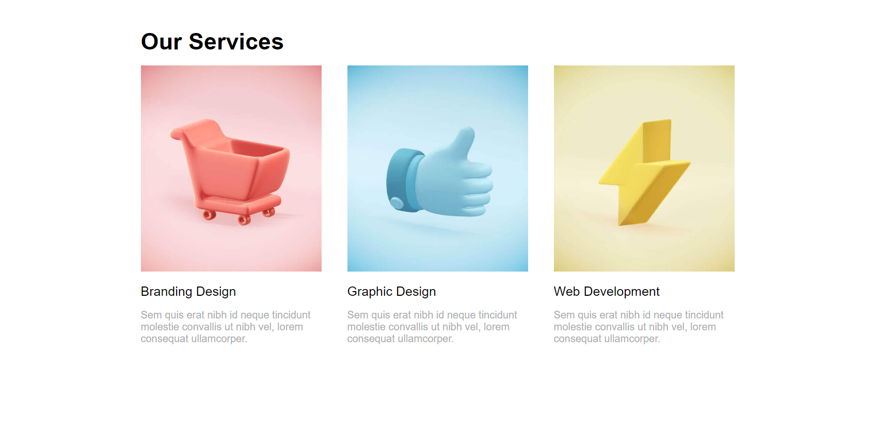
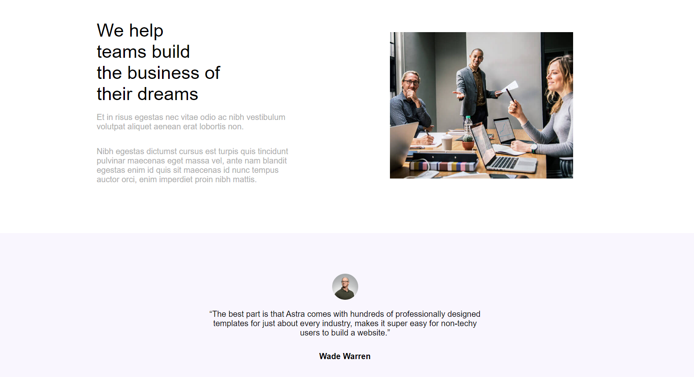

# Astra Theme

Astra adalah tema WordPress ringan dan sangat dapat disesuaikan, dirancang untuk kecepatan dan performa tinggi. Tema ini ideal untuk blog, portofolio, bisnis, dan situs eCommerce.

## Fitur Utama

- **Ringan & Cepat**: Astra sangat cepat, membuat pengalaman pengunjung Anda lebih baik.
- **Desain Responsif**: Astra sepenuhnya responsif, memastikan situs Anda terlihat hebat di semua perangkat.
- **Kompatibilitas dengan Pembuat Halaman**: Astra kompatibel dengan berbagai pembuat halaman seperti Elementor, Beaver Builder, dan Gutenberg.
- **Opsi Kustomisasi yang Luas**: Anda dapat mengubah gaya situs Anda dengan mudah tanpa perlu menulis kode.
- **Optimasi SEO**: Astra dilengkapi dengan fitur SEO yang membantu meningkatkan peringkat pencarian Anda.

## Cara Menginstal

1. **Melalui Dashboard WordPress**:
   - Buka **Appearance > Themes** di dashboard WordPress Anda.
   - Klik pada **Add New**.
   - Cari "Astra" di kolom pencarian.
   - Klik **Install** dan kemudian **Activate**.

2. **Melalui File ZIP**:
   - Unduh tema Astra dari [halaman resmi Astra](https://wp-themes.com/astra/).
   - Buka **Appearance > Themes**.
   - Klik pada **Add New** > **Upload Theme**.
   - Pilih file ZIP yang telah diunduh dan klik **Install Now**.

## Dokumentasi

Untuk panduan dan tutorial lebih lanjut, kunjungi [Dokumentasi Astra](https://wpastra.com/docs/).

## Kontribusi

Kontribusi untuk proyek ini sangat dihargai. Silakan buka issue atau buat pull request di [repository GitHub Astra](https://github.com/brainstormforce/astra).

## Lisensi

Tema Astra dilisensikan di bawah [GPL-2.0](https://opensource.org/licenses/GPL-2.0).

## Kontak

Jika Anda memiliki pertanyaan, silakan hubungi kami melalui halaman [Kontak](https://wpastra.com/contact/).
